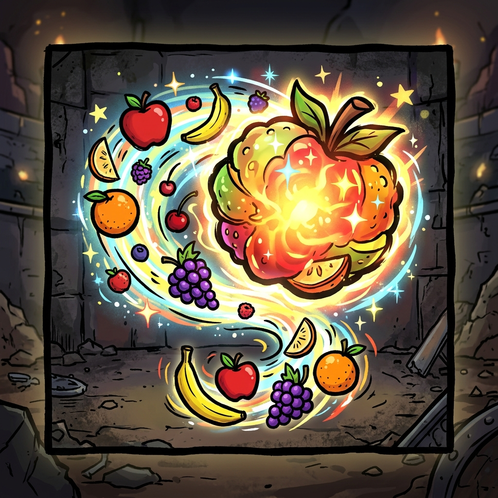

# Brotato - Fruit Aggregator Mod

Tired of late-game lag caused by hundreds of healing fruits cluttering up your arena? **Fruit Aggregator** solves this by magnetically merging nearby fruits on the ground into a single, glowing Mega-Fruit!

## Features

* **Performance Boost:** Significantly improves late-game FPS by cleaning up the arena and reducing the number of collision objects the Godot engine has to track.
* **100% Healing Preserved:** When fruits merge, their healing values are combined. If a Mega-Fruit absorbs 10 apples, picking it up will heal you for the exact same amount as picking up 10 individual apples.
* **Satisfying Visuals:** The Mega-Fruit dynamically changes color and glows brighter based on how much healing power it has absorbed!
* **Highly Compatible:** Designed using Godot ModLoader v6 standards. Fully compatible with Brotato 1.1+ (Paws & Claws / Abyssal Terrors).

## Installation

### Steam Workshop (Recommended)
You can simply subscribe to the mod on the Steam Workshop. Steam will automatically download and install it into your game.

### Manual Installation (Local)
If you prefer to install the mod manually:
1. Download the latest `Secdude-FruitAggregator.zip` from the Releases page.
2. Navigate to your Brotato installation directory (e.g., `C:\Program Files (x86)\Steam\steamapps\common\Brotato`).
3. Place the `.zip` file into the `mods/` directory.

## Configuration & ModOptions

This mod runs perfectly fine out of the box with balanced default settings. However, if you want to tweak its behavior, this mod is fully integrated with the **ModOptions** framework (compatible with both `dami-ModOptions` and `Oudstand-ModOptions`). 

If you have a ModOptions mod installed, you can configure the following in the game's Options menu:
* **Merge Radius:** How close fruits need to be before they magnetically snap together.
* **Min Fruits to Merge:** Set a threshold so fruits only start merging when your screen gets too cluttered (defaults to 0, which means they merge immediately).

### Advanced Configuration
Advanced users can also manually edit the underlying `default_config.json` inside the mod folder to tweak hidden performance limits (like `scan_interval` and `max_merges_per_tick`) if desired.

## Building from Source

To package the mod for the Godot ModLoader:
1. Clone this repository.
2. Run the provided python script: `python package_mod.py`.
3. The script will generate a properly structured `Secdude-FruitAggregator.zip` ready to be dropped into the game's `mods` folder.

## Credits
* Developed by Secdude
* Built using the Godot ModLoader framework
